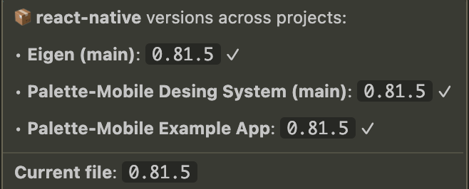

# Versions Atlas


VS Code extension to view dependency versions across multiple projects when hovering over package.json dependencies.



## Installation

### VS Code Marketplace

Search for "Versions Atlas" in the Extensions view (`Cmd+Shift+X` / `Ctrl+Shift+X`).

### Terminal

**VS Code:**
```bash
code --install-extension Mounir.versions-atlas
```

**Cursor:**
```bash
cursor --install-extension Mounir.versions-atlas
```

## Usage

1. Configure projects in VS Code settings:

```json
"versionsAtlas.projects": [
  {
    "name": "ProjectA",
    "packageJsonUrl": "https://raw.githubusercontent.com/org/project-a/main/package.json"
  },
  {
    "name": "ProjectB",
    "localPath": "~/projects/project-b/package.json"
  }
]
```

2. Open any `package.json` file
3. Hover over a dependency to see its versions across your configured projects

## Private Repositories

For private GitHub repos, set the `GITHUB_TOKEN` environment variable:

```bash
export GITHUB_TOKEN=ghp_xxxxxxxxxxxx
```

Or use local paths instead:

```json
{
  "name": "PrivateProject",
  "localPath": "~/work/private-project/package.json"
}
```

## Settings

| Setting | Default | Description |
|---------|---------|-------------|
| `versionsAtlas.projects` | `[]` | List of projects with name and URL or local path |
| `versionsAtlas.cacheTTL` | `300000` | Cache duration in ms (default: 5 min) |

## Commands

- **Versions Atlas: Refresh Cache** - Clear cached data and fetch fresh versions

## Contributing

Contributions are welcome! Feel free to open issues or submit pull requests on [GitHub](https://github.com/MounirDhahri/versions-atlas).
